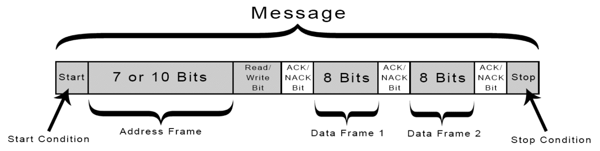
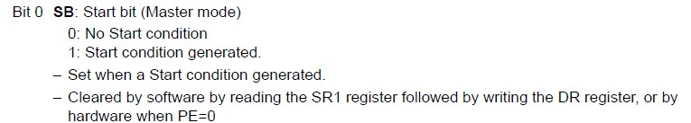

<body >
<h1>Interfacing BMP280 sensor with STM32F407VET6</h1>

<strong style="font-size:20px">
In this project, we will be reading temperature values from bmp280 using I2C communication protocol with STM32F407VET6 microcontroller.
</strong>

<section>
<h2>Contents</h2>
<ul  style="background-color:#c5d4cc;padding-top: 10px;padding-bottom: 10px;">

<li><a href="#about"><h3>About I2C</h3></a></li>
<li><a href="#comp"><h3>I2C Working</h3></a></li>
<li><a href="#conn"><h3>Connections</h3></a></li>
<li><a href="#bmp"><h3>Registers of BMP20</h3></a></li>
<li><a href="#code"><h3>Code Explanation</h3></a></li>
<li><a href="#exp"><h3>Final Result</h3></a></li>
</li>
</ul>
</section>

<section id="about">
<h1>About I2C</h1>
<p style="font-size:20px">
<strong>I2C (Inter Integrated Circuit) is bi-directional communication protocol. It uses two open drain wires SCL (Serial Clock) for clock signal and SDA (Serial Data) for data transfering. I2C has a master and a slave, clock signal is controlled by the master. I2C can be used with multiple master and slaves.<strong>&nbsp;</p>

<h2>I2C Format</h2>

<h5>Image Source:<a href="https://www.circuitbasics.com/" target="_blank">circuitbasics</a></h5>

<h3>Start bit</h3>
<p style="font-size:18px">
<strong>Start bit is 1-bit size, master initiates the start, SDA lines goes from high to low when SCL is high. <strong>&nbsp;</p>

<h3>Address bits</h3>
<p style="font-size:18px">
<strong>Address bits size depends on the I2C protocol used , it can be 7-bit or 10-bit, every slave has a unique address for identification.<strong>&nbsp;</p>

<h3>Read/Write bit</h3>
<p style="font-size:18px">
<strong>Read/write bit tells the whether master is sending the data or slave is sending. If Read/Write is 1 then, master is receiving the data from the slave and if it is 0, then master is sending the data.</p>

<h3>Data Frame</h3>
<p style="font-size:18px">
<strong>Data Frame is 8-bit, it contains the data sent by either the master or slave. Each time a data frame transfer happens, an acknowledge or no acknowledge bit is sent by either slave/master depending of R/W bit.</p>

<h3>Acknowledge bit</h3>
<p style="font-size:18px">
<strong>An Address and Data frame is always followed by an Acknowledge or no acknowledge bit.</p>

<h3>Stop bit</h3>
<p style="font-size:18px">
<strong>Start bit is 1-bit size, it is sent by the master to end the transmission, SDA line goes from low to high when SCL line is high.<strong>&nbsp;</p>

</section>

<section id="working">
<h2>I2C Working </h2>

<h3>Master Sending</h3>
<p style="font-size:18px">
<strong>START bit is sent by the master, then master sends the address of the slave with a write bit(0), then slave sends the ack when address is matched. Master sends the address location where the data to be written and ack/nack is sent by the slave,then data frames are sent by the master. Transmission ends with a STOP bit from the master. <strong>&nbsp;</p>

<br>

<h3>Master Receiving</h3>
<p style="font-size:18px">
<strong>START bit is sent by the master, then master sends the address of the slave with a write bit(0), then slave sends the ack when address is matched. Master sends the address location where data to be read.Then again use a start condition,followed by address of slave plus read bit(1),slave will send an acknowlegement,then slave will send the data frames, master will send the acknowledgement for each data frame that is sent by the slave,nack is sent by the master for the last data frame , then master ends transmission with a STOP condition.<strong>&nbsp;</p>

<br>
</section>

<section id="code">
<h2>Connections</h2>
<strong style="font-size:20px">
1. Connect +3.3v to Vcc <br>
2. Connect Gnd to Gnd   <br>
3. Connect PB8 to SCL    <br>
4. Connect PB9 to SDA    <br>
</strong>
</section>


<section id="bmp280">
<h2>Registers of BMP280 </h2>


<h3>Sampling</h3>


<h3>Power Modes</h3>

</section>

<section id="code">
<h2>Code Explanation</h2>


```
void config_clk(){
  
	RCC->APB1ENR |= RCC_APB1ENR_I2C1EN;
  
	RCC->AHB1ENR |= RCC_AHB1ENR_GPIOBEN;
  
}

```

Here, we are enabling clock for I2C1, since SCL and SDA pins for I2C1 are PA8 and PA9, we are enbling clock for GPIOA as well.

```

void config_gpio(){
  
    GPIOB->MODER |= GPIO_MODER_MODE9_1| GPIO_MODER_MODE8_1; //alternate mode
  
    GPIOB->MODER &= ~(GPIO_MODER_MODE9_0)| ~(GPIO_MODER_MODE8_0);
  
    GPIOB->OTYPER |= GPIO_OTYPER_OT8 |GPIO_OTYPER_OT9; //open drain
  
    GPIOB->OSPEEDR|= GPIO_OSPEEDER_OSPEEDR8_0 |GPIO_OSPEEDER_OSPEEDR8_1|GPIO_OSPEEDER_OSPEEDR9_0 |GPIO_OSPEEDER_OSPEEDR9_1; //High Speed
  
    GPIOB->PUPDR |= GPIO_PUPDR_PUPD8_0 | GPIO_PUPDR_PUPD9_0; //pull-up
  
    GPIOB->PUPDR &= ~(GPIO_PUPDR_PUPD8_1) | ~(GPIO_PUPDR_PUPD9_1);
  
    GPIOB->AFR[1] = 0x00000044UL; //setting AF4(I2C)
  
}

```

Here, we are making configuration for GPIO pins.
1. For Port mode Alternate Mode is selected for Pin 8 and 9.
2. Pin 8 and 9 output type is selected as open-drain since I2C SCL and SDA lines open-drain.
3. Pin 8 and 9 output speeds are choosen as high speed.
4. Pin 8 and 9 are selected as Pull-up.
5. Pin 8 and 9 are selected as AF4, since AF4 is I2C1


```

void config_i2c(){
  
     I2C1->CR1 |=  I2C_CR1_SWRST; //reset
  
     I2C1->CR1 &= ~(I2C_CR1_SWRST);
  
     I2C1->CR2 |= (16<<0); //f_clk 16Mhz
  
     I2C1->CCR |= 80<<0; //i2c-100khz
  
     I2C1->TRISE = 17;
  
     I2C1->CR1 |= I2C_CR1_PE; // I2C enable
}

```

Here, we are configuring the I2C.
  
1. In CR2, we are setting peripheral bus (APB1) clock frequency as 16Mhz.
 
 
  
  
2. In Clock Control register(CCR), I2C frequency for SCL is selected as 100Khz.
  
   Calculation:
  
   CCR = (fclk)/(SCL*2)
  
   CCR = (16Mhz/100Khz * 2) = 80
  
3. TRISE calculation:
  
   TRISE = (1000ns/(1/fclk))+1
  
         = (1000ns/(1/16Mhz))+1 = 17
  
4. Finally, Enabling the I2C in CR1.

```

void i2c_start(){
  
    I2C1->CR1 |= I2C_CR1_START; //i2c start
  
    while(!(I2C1->SR1 & I2C_SR1_SB)); //wait till start bit is set
}

void i2c_stop(){
  
   I2C1->CR1 |= I2C_CR1_STOP;//i2c stop
  
}

```

These are start and Stop function for I2C.
1. Start bit is set in CR1 register.
2. waiting till the start bit set by checking SR bit in status register.

1. To stop transmission , stop bit is set in CR1.



```

void i2c_address(unsigned char addr){
  
    I2C1->DR = addr;
  
    while(!(I2C1->SR1 & I2C_SR1_ADDR)); //wait till address bit is set
  
    unsigned char temp = I2C1->SR1 | I2C1->SR2;
  
}

void i2c_write(unsigned char data){
  
	while(!(I2C1->SR1 & I2C_SR1_TXE));//wait till data register is empty
  
	I2C1->DR = data;
  
	while(!(I2C1->SR1 & I2C_SR1_BTF));//wait till byte transfer is complete
}


```

These are functions to sent the data and address
<h4>Sending Address</h4>
	
1. Data register(DR) is loaded with address value<br>
2. Wait till the ADDR bit in status register is set, if it is set then address is matched.<br>
3. Clear SR1 and SR2 registers


<h4>Sending Data</h4>
	
1. Waits till the Data register and empty i.e TXE bit to set.
2. Data register(DR) is loaded with data.
3. Waits till byte transfer is completed i.e BTF bit to set.


```

void set_bmp280(){
  
	i2c_write(0xF4);//Mode and sampling regsiter
  
	i2c_write(0xA3);//Normal Mode ,16x sampling
  
	i2c_write(0xF5);//config register
  
	i2c_write(0x8C);//standby_mode-500 and filter and NO SPI
}

```
	
Here, we are setting mode,sampling,filter,stand by mode.

1. At 0xF4 location, we are setting mode as normal mode and temperature sampling as x16.
2. At 0xF5 location, we are setting standby and filter.

```

void get_temp(int byteno){
  
    int i=0;
  
    i2c_start();
  
    i2c_address(0xEC);
  
    i2c_write(0xFA);//setting pointer to MSB of temperature register
  
    i2c_start();
  
    i2c_address(0xED);//address + Read
  
    unsigned char temp = I2C1->SR1 | I2C1->SR2; //clearing SR1 and SR2
  
    for(i=0;i<byteno-1;i++){
                             
       I2C1->CR1 |= I2C_CR1_ACK;//Acknowledge
  
       while(!(I2C1->SR1 & I2C_SR1_RXNE)); //wait till data register is empty
  
       data_buffer[i] = I2C1->DR; //read the data from DR
  
    }
  
    I2C1->CR1 &= ~(I2C_CR1_ACK);//no ACK
  
    while(!(I2C1->SR1 & I2C_SR1_RXNE));//wait till data register is empty
  
    data_buffer[i] = I2C1->DR;
  
    i2c_stop();
  
}

```

Here, we are storing the data from msb,lsb,x_lsb 20-bit data from the registers into data_buffer array.

1. First, we write to the sensor the address location of msb of temp i.e 0xFA.
2. Then, we read from the sensor, 3 bytes of data is read from sensor at location FA,FB,FC.
3. We set the ack bit in CR1 regsiter.
4. wait till data register is empty, i.e RXNE bit is set in status register.
5. one byte of data is read from DR and stored in array.
6. For last byte, ack is reset in CR1.
7. Stop function is called.

```

raw_temp = (((long)data_buffer[0]<<12) | ((long)data_buffer[1]<<4)|((long)data_buffer[2]>>4))& 0xFFFFFFFF ;

long temp_calc(long adc_T){
  
	long int t_fine;
  
	long signed int var1, var2, T;
	unsigned short dig_T1 = 27504;
  
	short dig_T2 = 26435;
  
	short dig_T3 = -1000;
  
	var1 = ((((adc_T >> 3) - ((long int)dig_T1 << 1))) * ((long int)dig_T2)) >> 11;
  
	var2 = (((((adc_T >> 4) - ((long int)dig_T1)) * ((adc_T >> 4) - ((long int)dig_T1))) >> 12) * ((long int)dig_T3)) >> 14;
  
	t_fine = var1 + var2;
  
	T = (t_fine * 5 + 128) >> 8;
  
	return T;
}

```

1. The data stored in the array is converted to a 20-bit and stored in the raw_temp  variable.
2. long_temp function is used to convert the 20-bit value into meaningful information. For example, if it returns the value as 2687, then the temperature is 26.87 centrigrade. This function can be found bmp280 datasheet.

```

void print_value(){
  
	char str2[10];
  
	raw_temp = (((long)data_buffer[0]<<12) | ((long)data_buffer[1]<<4)|((long)data_buffer[2]>>4))& 0xFFFFFFFF ;
  
        temperature = temp_calc(raw_temp);
  
	sprintf(str2,"%d",temperature);
  
	for(int i=0;i<strlen(str2);i++){
                                   
		send_char(str2[i]);
                                   
		if(i==1){
                                   
			send_char('.');
                                   
		}
	}
                                   
	send_char('C');
                                   
	send_char('\n');

}

```

This function is used to print values using UART.
</section>

<section id="out">
<h2>Final Output</h2>
To check values using uart, use CP2102(TTL to USB), connect PA2 to rx pin CP2102.Use Hercules utilty to observe the values. without UART we can use live expressions using debug mode to check the values.

</section>

</body>
